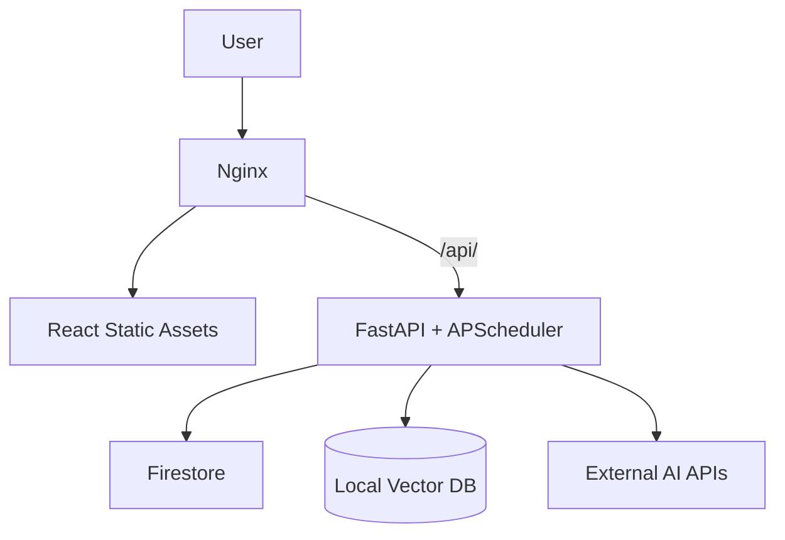

# AAYU - Production Ready Healthcare Platform

AAYU is a comprehensive, AI-powered healthcare platform combining real-time public health intelligence, telemedicine, and multilingual voice capabilities.

## Architecture

AAYU is built with a modern, scalable, and decoupled architecture:

- **Frontend:** React + Vite, deployed as static assets served by Nginx.
- **Reverse Proxy:** Nginx (handles compression, caching, and `/api` routing).
- **Backend:** FastAPI (Python), providing asynchronous AI integration, scheduler, and API endpoints.
- **Database/Auth:** Firebase (Firestore) and Google Cloud services.
- **AI/LLMs:** Google Gemini, OpenAI, Ollama (fallback), and local ChromaDB for vector retrieval.

### Docker Deployment Architecture



## Setup & Deployment

### 1. Prerequisites
- Docker and Docker Compose installed.
- API Keys for Google Gemini, WeatherAPI, NewsData, and Firebase.

### 2. Environment Variables
Copy the provided `.env.example` templates to `.env`.

**Frontend (`.env`)**
```env
VITE_API_URL="/api"
# (Add Firebase client keys)
```

**Backend (`backend/.env`)**
```env
PORT=8000
ENVIRONMENT="production"
GOOGLE_APPLICATION_CREDENTIALS="/app/credentials/serviceAccountKey.json"
# (Add Gemini, Weather, News API keys)
```

### 3. Firebase Credentials
To allow the backend to communicate with Firestore, you must provide a Service Account JSON.
1. Generate a new private key from Firebase Console -> Project Settings -> Service Accounts.
2. Save it to `credentials/serviceAccountKey.json`.
*(This folder is mounted into the Docker container as read-only).*

### 4. Running the Platform

To build and start the entire stack in production mode:
```bash
docker compose up --build -d
```

### 5. Health Checks
The backend provides a comprehensive health endpoint that validates all downstream API dependencies without crashing if optional ones are missing.
Visit `http://localhost/api/health` to verify system status.

## Development

To run the application locally without Docker:

**Frontend**
```bash
npm install
npm run dev
```

**Backend**
```bash
cd backend
python -m venv venv
source venv/bin/activate  # or venv\Scripts\activate on Windows
pip install -r requirements.txt
uvicorn app.main:app --reload
```

## Security Improvements
- API endpoints are hidden behind an Nginx reverse proxy, protecting backend ports.
- Structured logging deployed.
- Security headers (HSTS, X-Frame-Options, XSS protection) added.
- Unnecessary debug logs and paths removed.

## Troubleshooting
- **No Map or GIS Loading:** Ensure your frontend has `VITE_GOOGLE_MAPS_API_KEY` defined.
- **Permission Denied in Logs:** Ensure your `serviceAccountKey.json` is correctly named and placed in `credentials/`.
- **APScheduler Warnings:** The backend will automatically warn if an API is unavailable but will keep the scheduler running for other intelligence tasks.
