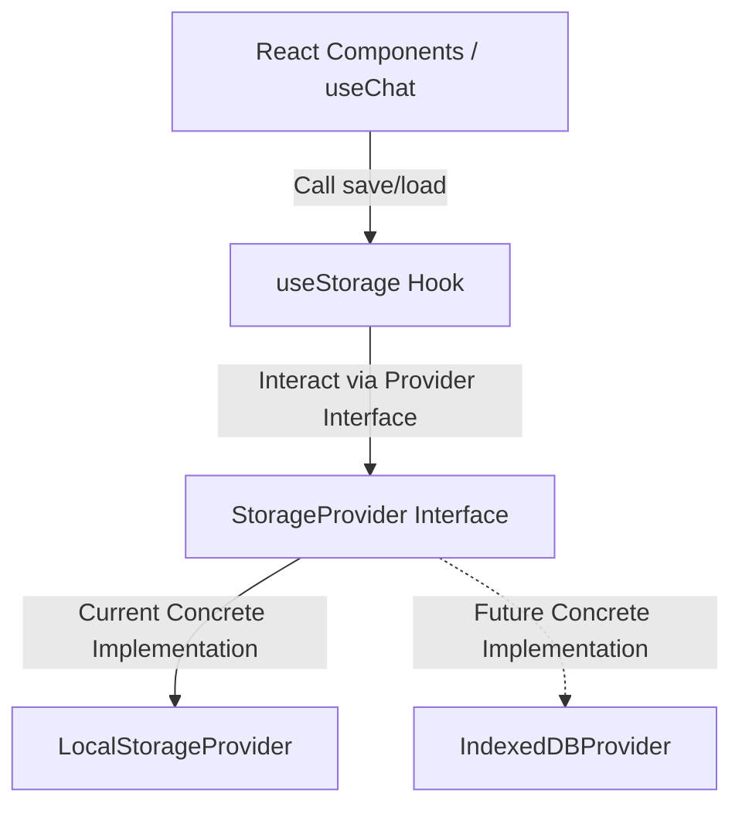

# Aayu Healthcare Assistant - Architectural Specification & Migration Plan

This document represents the final architectural specification and migration plan to refactor **Thinkly.AI** (Decision Diary) into **Aayu**, a local-first, privacy-respecting healthcare assistant.

---

## 1. Final Folder Structure

```txt
d:\Aayu\
├── src/
│   ├── assets/                 # Brand logos and interface asset icons
│   ├── components/
│   │   ├── Chat/
│   │   │   ├── ChatWindow.tsx  # Scrollable chat feed container
│   │   │   ├── MessageBubble.tsx # UI chat bubble component
│   │   │   └── InputArea.tsx   # Textarea message input & Web Speech triggers
│   │   ├── Sidebar/
│   │   │   └── Sidebar.tsx     # Session selector & search filters panel
│   │   ├── HealthPanel/
│   │   │   └── HealthSummary.tsx # Main active symptoms editor and RAG suggestions
│   │   └── Common/
│   │       └── DisclaimerBanner.tsx # Crucial medical safety liability banner
│   ├── config/
│   │   ├── ollama.ts           # Local model and endpoint definitions
│   │   ├── app.ts              # General configuration overrides
│   │   └── constants.ts        # Shared app parameters (stop words, default values)
│   ├── data/
│   │   ├── healthKnowledge.json # Starter medical information RAG source (Common Cold, Fever, Dengue, etc.)
│   │   ├── healthcareCenters.json # Clinics registry with locations and categories
│   │   └── governmentSchemes.json # Public healthcare schemes registry
│   ├── hooks/
│   │   ├── useChat.ts          # Integrator hook for messages list and inputs
│   │   ├── useOllama.ts        # Communication client for Ollama HTTP endpoints
│   │   ├── useSpeech.ts        # Transcriptions and vocal synthesis hook
│   │   └── useStorage.ts       # Storage client mapping records using StorageProvider
│   ├── pwa/
│   │   └── registerServiceWorker.ts # Future PWA registration helper
│   ├── services/
│   │   ├── healthcare.ts       # Symptom extraction, summaries, and advisor prompt templates
│   │   └── rag/
│   │       ├── retrieval.ts    # Search algorithms and token scoring implementation
│   │       └── types.ts        # Retrieval context interfaces
│   ├── types/
│   │   ├── index.ts            # Core health record, message, and attachment interfaces
│   │   └── storage.ts          # Storage provider interface declarations
│   ├── App.tsx                 # Core grid wrapper and style integrator
│   ├── App.css                 # CSS overrides
│   ├── ErrorBoundary.tsx       # UI crash protection wrapper
│   ├── index.css               # Imports standard style files
│   ├── main.tsx                # Bootstrap React
│   └── style.css               # Standard stylesheet variables and transitions
```

---

## 2. Final Type Definitions

### `src/types/index.ts`
```typescript
export interface Attachment {
  id: string;
  name: string;
  type: "image" | "pdf" | "document" | "raw";
  url: string; // Object URL or base64 representation for local-first storage
  ocrText?: string; // Captured OCR output for text index querying in Phase 3
  uploadedAt: number;
}

export interface HealthRecord {
  id: string;
  summary: string; // AI generated 30-word summary sentence
  symptoms: string;
  duration: string;
  severity: "low" | "medium" | "high" | "";
  age: string;
  gender: string;
  location: string; // Vital for resource maps and region scheme recommendation
  preExistingConditions: string;
  triggers: string;
  attachments: Attachment[]; // Handles medical images, reports, and PDFs
  createdAt: number;
}

export interface Message {
  role: "user" | "ai";
  text: string;
}

export type HealthFieldKey =
  | "symptoms"
  | "duration"
  | "severity"
  | "age"
  | "gender"
  | "location"
  | "preExistingConditions"
  | "triggers";

export interface MemoryVector {
  id: string;
  vector: Record<string, number>;
}
```

### `src/types/storage.ts`
```typescript
export interface StorageProvider<T> {
  save(key: string, data: T): void;
  load(key: string): T | null;
  remove(key: string): void;
  clear(): void;
}
```

---

## 3. Final Responsibilities

### Config Layer

#### 1. `config/ollama.ts`
* **Responsibility**: Endpoint URL, model configuration, option payloads.
* **Dependencies**: None.

#### 2. `config/app.ts`
* **Responsibility**: Default user profile parameters, app names, thresholds.
* **Dependencies**: None.

#### 3. `config/constants.ts`
* **Responsibility**: List of stop words for similarity vector building, default messages.
* **Dependencies**: None.

### Data Layer

#### 1. `data/healthKnowledge.json`
* **Responsibility**: Structured medical articles (Ailments, symptoms, guide instructions, precautions).
* **Dependencies**: None.

#### 2. `data/healthcareCenters.json`
* **Responsibility**: Database of local hospitals and clinics.
* **Dependencies**: None.

#### 3. `data/governmentSchemes.json`
* **Responsibility**: Database of state and central medical policies.
* **Dependencies**: None.

### Services Layer

#### 1. `services/healthcare.ts`
* **Responsibility**: Houses clinical advisor templates, extraction schema instructions, and language detection rules.
* **Inputs**: Message list or active record parameters.
* **Outputs**: Formatted prompt strings.
* **Dependencies**: `config/ollama.ts`.

#### 2. `services/rag/retrieval.ts`
* **Responsibility**: Keyword extraction and TF-IDF search scoring.
* **Inputs**: Search query string, limit count.
* **Outputs**: Array of retrieved `KnowledgeEntry` items.
* **Dependencies**: `services/rag/types.ts`, `data/healthKnowledge.json`.

### Hooks Layer

#### 1. `hooks/useStorage.ts`
* **Responsibility**: Synchronize saved health records and search vectors with LocalStorage.
* **Inputs**: None.
* **Outputs**: Records list, active vector list, update operations.
* **Dependencies**: `types/index.ts`, `types/storage.ts`.

#### 2. `hooks/useSpeech.ts`
* **Responsibility**: Handles microphone inputs and audio synthesis via browser APIs.
* **Inputs**: Text to say (for synthesis).
* **Outputs**: Transcript, listening indicators, triggers.
* **Dependencies**: None.

#### 3. `hooks/useOllama.ts`
* **Responsibility**: Sends HTTP requests to the Ollama server and handles JSON response checks.
* **Inputs**: Prompt string, settings overrides.
* **Outputs**: Raw text response or parsed object.
* **Dependencies**: `config/ollama.ts`.

#### 4. `hooks/useChat.ts`
* **Responsibility**: Integrator managing chat logs, current inputs, active symptom fields, and coordinating backgrounds.
* **Inputs**: None.
* **Outputs**: Message list, active record state, send trigger, status logs.
* **Dependencies**: `hooks/useOllama.ts`, `services/healthcare.ts`, `services/rag/retrieval.ts`, `hooks/useStorage.ts`.

### Components Layer

#### 1. `ChatWindow.tsx`
* **Responsibility**: Map and scroll messages.
* **Inputs**: Messages list, active state flags.
* **Outputs**: React nodes.
* **Dependencies**: `MessageBubble.tsx`.

#### 2. `MessageBubble.tsx`
* **Responsibility**: Display chat bubble.
* **Inputs**: Message object.
* **Outputs**: React node.
* **Dependencies**: None.

#### 3. `InputArea.tsx`
* **Responsibility**: Text input forms, voice recording key triggers.
* **Inputs**: Input string, speech states, submit handlers.
* **Outputs**: Input layout elements.
* **Dependencies**: None.

#### 4. `Sidebar.tsx`
* **Responsibility**: History search pane.
* **Inputs**: Records lists, active selectors, deletion handlers.
* **Outputs**: Panel UI components.
* **Dependencies**: None.

#### 5. `HealthSummary.tsx`
* **Responsibility**: Symptom fields editor and RAG recommendations view.
* **Inputs**: Active record state, advisor triggers, save actions.
* **Outputs**: Detailed editor layout.
* **Dependencies**: `Common/DisclaimerBanner.tsx`.

#### 6. `Common/DisclaimerBanner.tsx`
* **Responsibility**: Show liability text.
* **Inputs**: Optional CSS class overrides.
* **Outputs**: Alert box.
* **Dependencies**: None.

---

## 4. App.tsx Refactor Mapping

```txt
┌────────────────────────────────────────────────────────┐
│ App.tsx: Top Level Shell Grid & Styles                 │
└───────────────────────────┬────────────────────────────┘
                            │ Outsources logic to:
                            ├── <Sidebar />
                            ├── <ChatWindow />
                            ├── <HealthSummary />
                            └── Orchestrator hooks

Refactored Segments:
1. Lines 5-41 (Diary Types) -> Moved to src/types/index.ts
2. Lines 53-68 (Field questions) -> Moved to src/services/healthcare.ts
3. Lines 75-125 (Main states) -> Moved to src/hooks/useChat.ts & useStorage.ts
4. Lines 127-160 (Storage loading) -> Moved to src/hooks/useStorage.ts
5. Lines 163-224 (Ollama System Prompts) -> Moved to src/services/healthcare.ts & hooks/useOllama.ts
6. Lines 322-416 (Vector matching logic) -> Moved to src/services/rag/retrieval.ts
7. Lines 471-744 (Dialogue Send/Receive) -> Moved to src/hooks/useChat.ts & hooks/useOllama.ts
8. Lines 747-772 (Ollama base fetch) -> Moved to src/hooks/useOllama.ts
9. Lines 775-820 (Summary sentence creator) -> Moved to src/hooks/useOllama.ts & services/healthcare.ts
10. Lines 825-882 (Persist saving) -> Moved to src/hooks/useStorage.ts
11. Lines 888-1003 (Advisory prompts/loops) -> Moved to src/hooks/useChat.ts & services/healthcare.ts
```

---

## 5. Storage Architecture



### Future IndexedDB Expansion
Since the hook `useStorage` only interacts with the generic `StorageProvider` interface, migrating to IndexedDB in Phase 3 does not require changing any UI component or orchestrator hook:
1. Implement a class `IndexedDBProvider` satisfying the `StorageProvider` interface.
2. Replace the instantiation in `useStorage.ts` with the new provider instance.

---

## 6. RAG Architecture

```
[User Message Query]
       │
       ▼
[Clean text & Tokenize query]
       │
       ▼ (Pass to Retriever.retrieve())
[LocalRetriever calculates TF-IDF against src/data/healthKnowledge.json]
       │
       ▼
[Match results: list precautions & advice]
       │
       ▼ (Format as medical grounding block)
[Inject grounding block into Ollama clinical advisor prompt]
       │
       ▼
[Ollama generates medically safe response]
```

### Future Vector DB Integration
To upgrade retrieval to a dedicated vector DB (e.g., ChromaDB, FAISS):
1. Implement the `Retriever` interface in a new class, `ChromaRetriever`.
2. Connect `ChromaRetriever` to the database client endpoint.
3. Switch the retriever instance inside `useChat.ts` or the matching service. The system logic continues working seamlessly.

---

## 7. PWA Architecture

To integrate PWA functionality in Phase 2:
1. **Service Worker Placement**: Add `sw.js` in `/public` to intercept fetches and implement offline strategies (Cache First for fonts/images, Network First for scripts).
2. **Offline Support**: Store `healthKnowledge.json` locally so symptom searches and recommendations operate without internet connectivity.
3. **Installability**: Include a `manifest.json` in `/public` containing icons, orientations, and launching variables.
4. **Push Notifications**: Integrate native push channels within the service worker to broadcast health alerts (e.g. disease alert thresholds).

---

## 8. Exact File Creation Checklist

1. `[ ]` **Step 1**: Create `src/types/index.ts` with Aayu data models (Attachments, HealthRecord, Messages).
2. `[ ]` **Step 2**: Create `src/types/storage.ts` with the `StorageProvider` interface.
3. `[ ]` **Step 3**: Create config files: `src/config/ollama.ts`, `src/config/app.ts`, `src/config/constants.ts`.
4. `[ ]` **Step 4**: Create static databases: `src/data/healthKnowledge.json` (covering dengue, cold, typhoid, malaria, dengue), `src/data/healthcareCenters.json`, `src/data/governmentSchemes.json`.
5. `[ ]` **Step 5**: Create RAG types `src/services/rag/types.ts` and retrieval logic in `src/services/rag/retrieval.ts`.
6. `[ ]` **Step 6**: Create prompts and helper questions in `src/services/healthcare.ts`.
7. `[ ]` **Step 7**: Create storage hook `src/hooks/useStorage.ts` implementing `LocalStorageProvider`.
8. `[ ]` **Step 8**: Create base Ollama connection hook `src/hooks/useOllama.ts`.
9. `[ ]` **Step 9**: Create Web Speech hook `src/hooks/useSpeech.ts`.
10. `[ ]` **Step 10**: Create conversation coordinator `src/hooks/useChat.ts` with simplified UI state (no complex modes).
11. `[ ]` **Step 11**: Create reusable components: `src/components/Common/DisclaimerBanner.tsx`, `src/components/Chat/MessageBubble.tsx`, `src/components/Chat/InputArea.tsx`, `src/components/Chat/ChatWindow.tsx`, `src/components/Sidebar/Sidebar.tsx`, `src/components/HealthPanel/HealthSummary.tsx`.
12. `[ ]` **Step 12**: Refactor `src/App.tsx` and run verification.

---

## 9. Development Order

1. **Phase 1: Foundations**: Types, Configs, Data JSON files, and RAG retrieval implementation.
2. **Phase 2: Core Models & Stubs**: useOllama connection and useStorage integrations.
3. **Phase 3: Dialogue Orchestration**: useChat, useSpeech hooks, and components structure setup.
4. **Phase 4: Shell Refactoring**: App.tsx integrations, layout refinement, and compile verification.
5. **Phase 5: Medical Verification**: Confirm disclaimers, RAG triggers, and offline compatibility.
